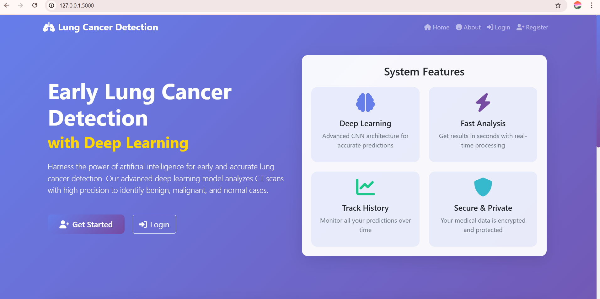
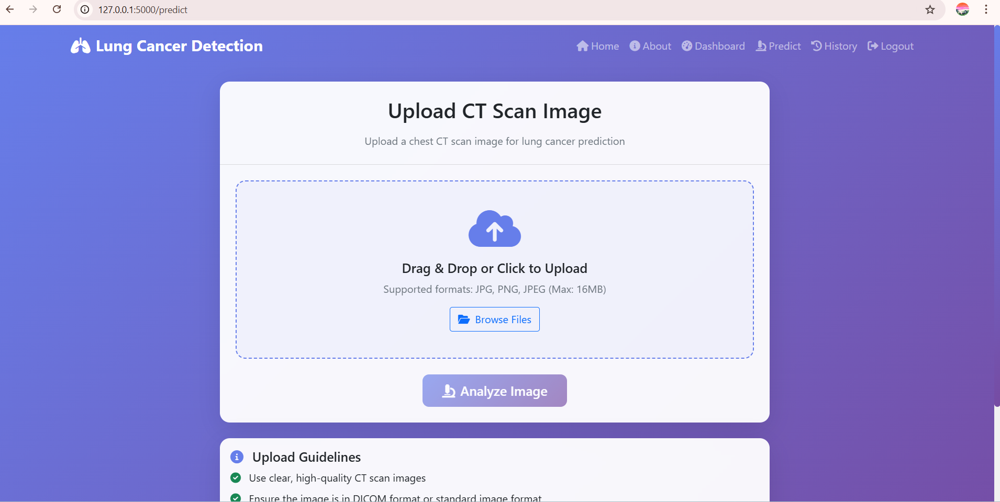
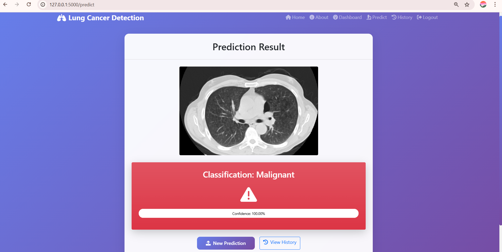
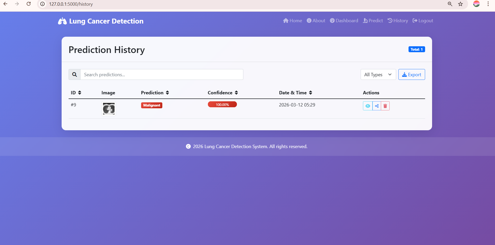
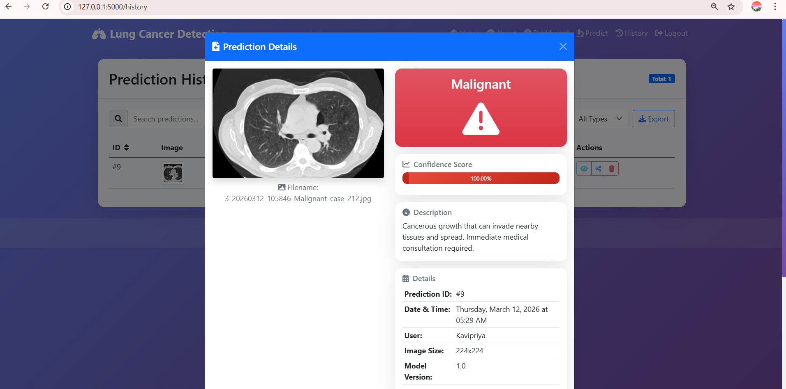
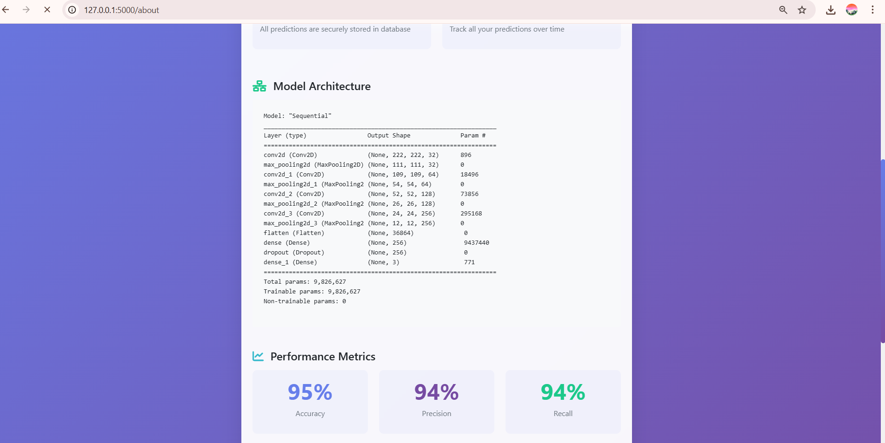

# 🫁 Lung Cancer Detection using Deep Learning (CNN)

This project presents a **Deep Learning-based Lung Cancer Detection System** that classifies CT scan images into three categories:

- **Benign**
- **Malignant**
- **Normal**

The model is built using a **Custom Convolutional Neural Network (CNN)** implemented with **TensorFlow and Keras**.  
It helps in automatically detecting lung cancer patterns from CT scan images.

---

## 📌 Project Overview

Early detection of lung cancer is critical for improving patient survival rates.  
This project uses **Computer Vision and Deep Learning techniques** to automatically classify CT scan images into different lung cancer categories.

The model learns features such as:

- Tumor shape
- Tissue density
- Abnormal lung patterns

This system can assist medical professionals in **faster and more accurate diagnosis**.

---

## 🧠 Model Architecture

The CNN model consists of:

- Convolution Layers
- MaxPooling Layers
- Fully Connected Dense Layers
- Dropout Layer (to reduce overfitting)
- Softmax Output Layer

### Architecture Flow

Input Image (224x224x3)

↓

Conv2D (32)

↓

MaxPooling

↓

Conv2D (64)

↓

MaxPooling

↓

Conv2D (128)

↓

MaxPooling

↓

Conv2D (256)

↓

MaxPooling

↓

Flatten

↓

Dense (256)

↓

Dropout (0.5)

↓

Dense (3) → Output Classes

---

## 📊 Model Evaluation Metrics

The model performance is evaluated using important medical AI metrics:

- **Accuracy**
- **Precision**
- **Recall (Sensitivity)**
- **Specificity**
- **F1 Score**
- **Confusion Matrix**
- **ROC-AUC Score**
- **Precision-Recall Curve**

These metrics help measure the model’s effectiveness in detecting lung cancer cases.

---

## 🖼️ Project Screenshots

### Model Prediction

---
---

## 🛠 Technologies Used

- Python
- TensorFlow
- Keras
- NumPy
- Matplotlib
- Scikit-learn
- Seaborn

---

## 👥 Team Contribution

This project was developed as part of a final year team project.
